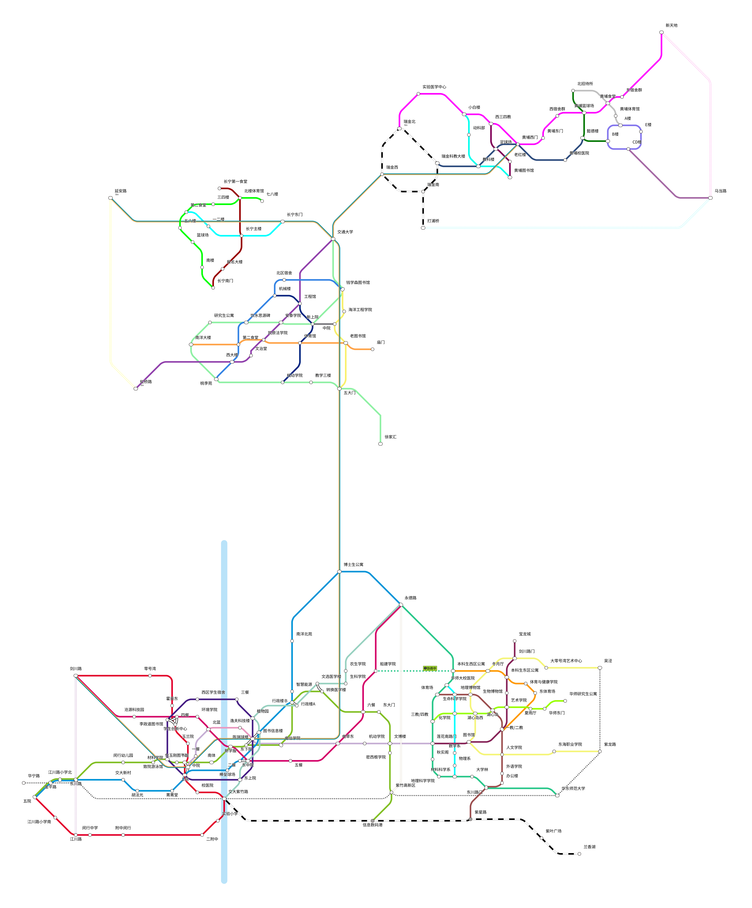

一个覆盖上海闵行高校及交大各校区的铁路系统。
A railway system among universities in Minhang, Shanghai.

只是想象。
Just imagination.

由https://railmapgen.github.io/?app=rmp生成。
Generated by https://railmapgen.github.io/?app=rmp

目前仅有上海交通大学闵行/徐汇/黄埔/长宁校区及华师大闵行校区部分。
Now only SJTU has a railway system.
高铁上驰骋吧。
Let's have fun in building MUR.

感谢所有在 https://shuiyuan.sjtu.edu.cn/t/topic/295957 上提供想法建议和支持的人。
THANKS ALL IN https://shuiyuan.sjtu.edu.cn/t/topic/295957 who provides ideas, suggestions and supports.

原作者 wznmickey， 由水源用户 shipship 提供华师大地铁设计。
BY-NC-SA https://creativecommons.org/licenses/by-nc-sa/4.0/deed.zh
